# missingPERSON 

The outlay of crime and missing cases in India is intensifying
day by day. An app is developed to scale back the crimes and
therefore the missing cases happening within the locality.

## About the project

The project missingPERSON is an Android Mobile Application built
using Flutter for Microsoft Engage 2022, used to help the community
find people (specially children and senior citizen) in the event
of their loss, using the Flutter Face API for face matching.
Users can post the lost or found requests in the app through their
accounts. If any of the lost requests matches with any of the found requests
then both the users are notified. 

## Salient Features

- Login and Sign Up features implemented through Firebase authentication.
- The Email is sent to the registered email to reset the password incase user forget the password.
- Mobile Number field is required during Sign Up to corner the creation of fake accounts.
- The user can add new post, delete post after sucessfully finding the person and edit information.
- The finders can directly click image from their phones on the spot( image picker is used).
- DatePicker and TimePicker are used to fill the date and time field in from.
- The faces are matched by the flutter API.

## Technology Stack

- Flutter and Dart were used to develop the application
- The backend has been implemented using Firebase (Firebase authentication, Firestore and Firebase Storage have been used)
- The faces are matched using Regula Face API (Flutter version)
- Necessary packages were imported from pub.dev

## Compatibility

The flutter application is compatible to run on android smart phones.

## Flow of App

## Screenshots

Splash Screen            |  First Screen                |  Second Screen
:-------------------------:|:-------------------------:|:-------------------------:
  |  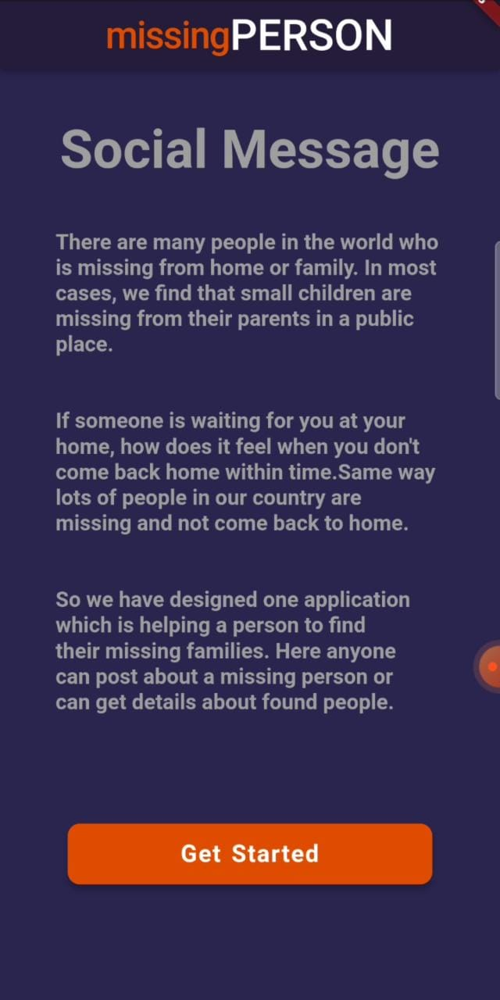 |  

SignUp Screen           |                 |  |
:-------------------------:|:-------------------------:|:-------------------------:
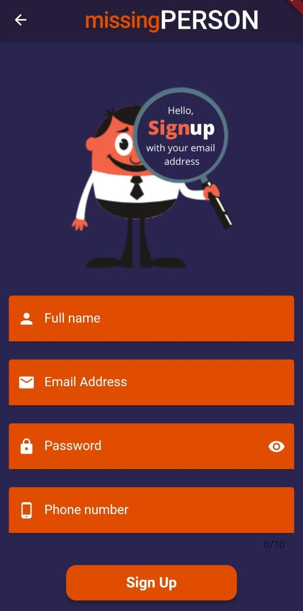  |   |  

Login Screen           |  Forget Password screen  | |
:-------------------------:|:-------------------------:|:-------------------------:
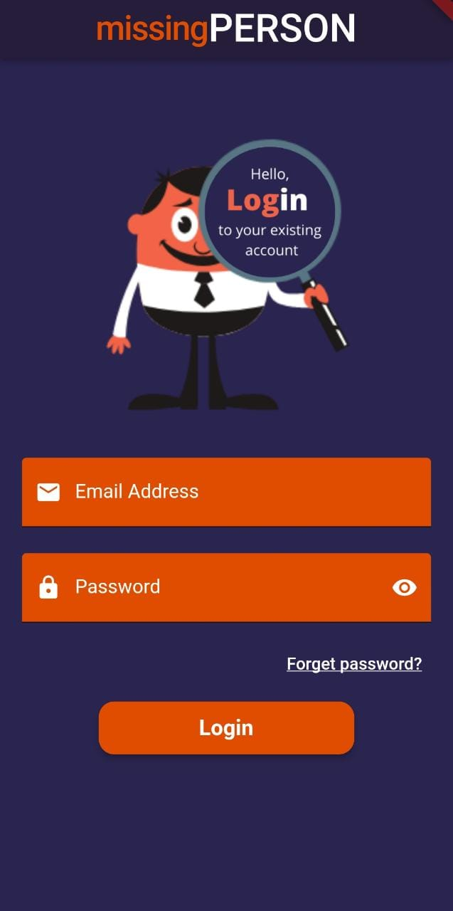  |   |  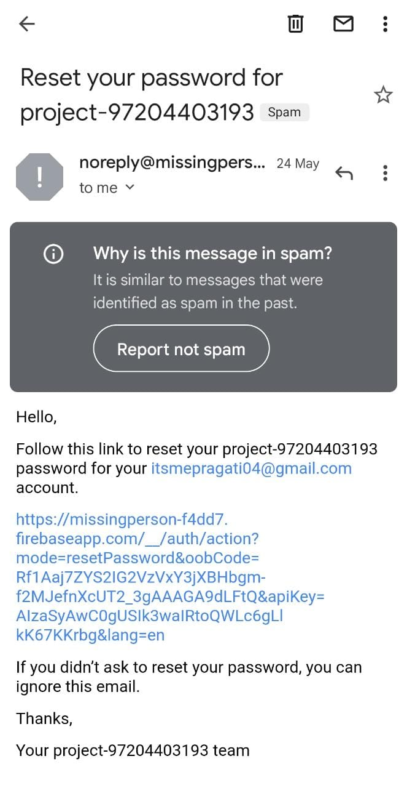

Form Screen            |               |  |
:-------------------------:|:-------------------------:|:-------------------------:
  |  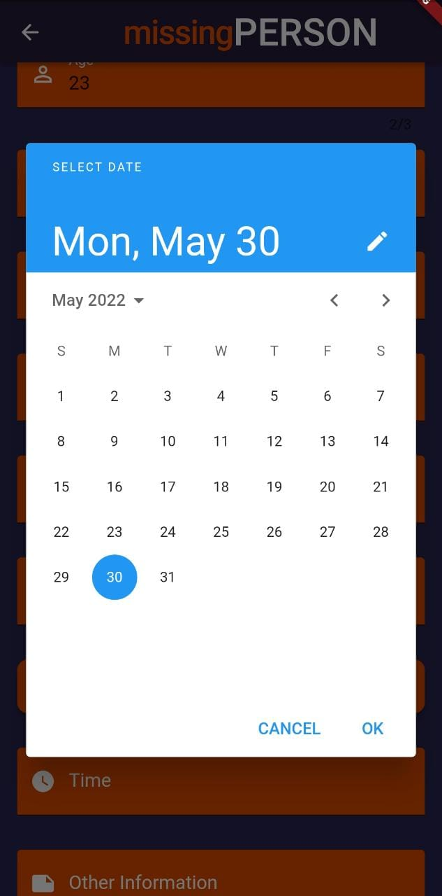 |  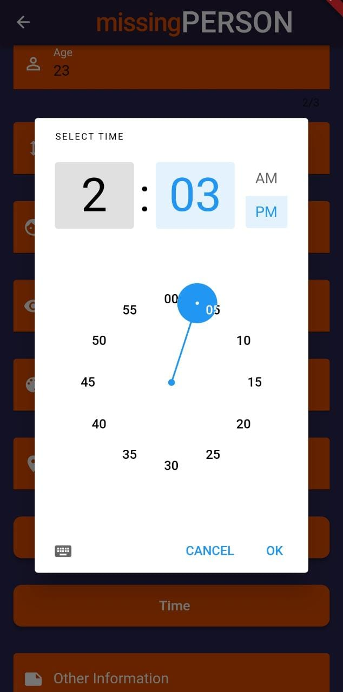

Uploading Image Screen            |                 |  |
:-------------------------:|:-------------------------:|:-------------------------:
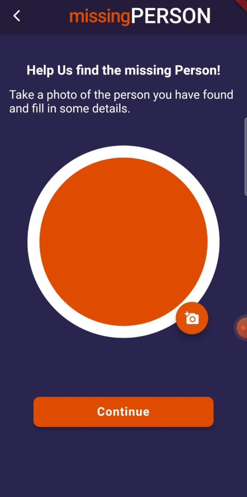  |  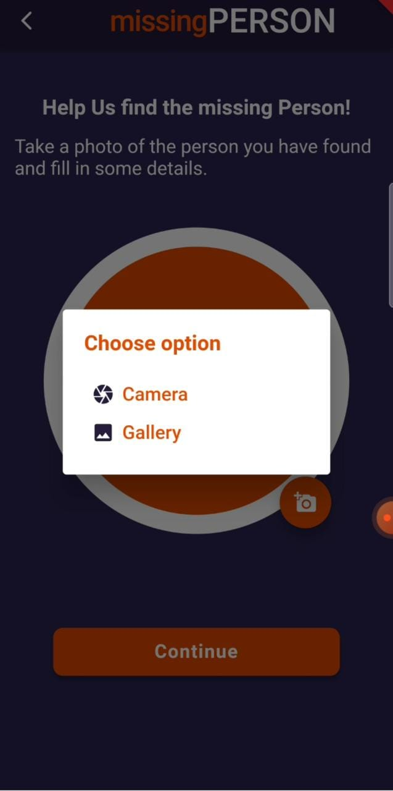 |  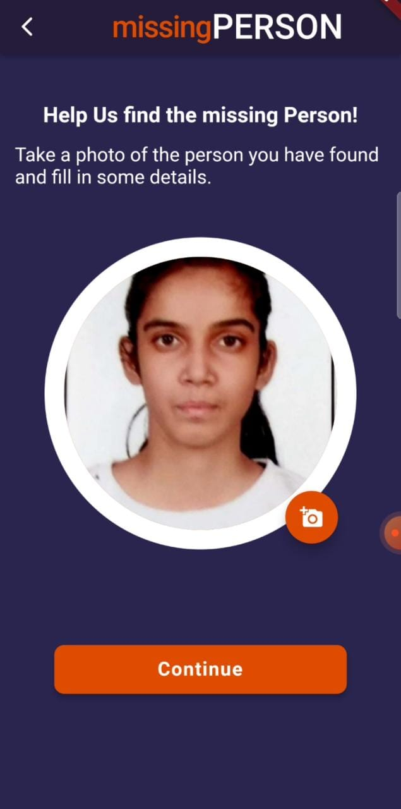

Welcome Screen            |                  |   My Post Screen
:-------------------------:|:-------------------------:|:-------------------------:
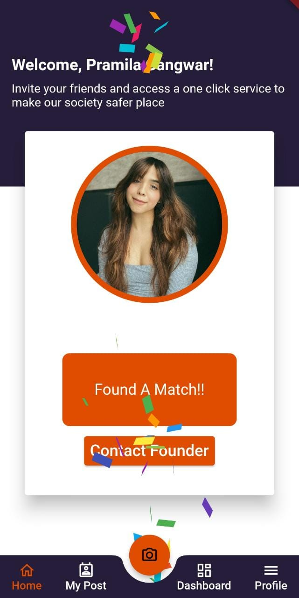  |  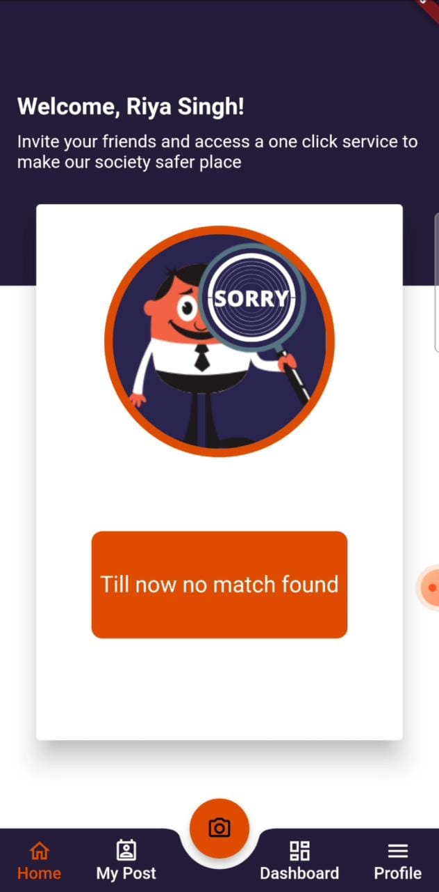 |  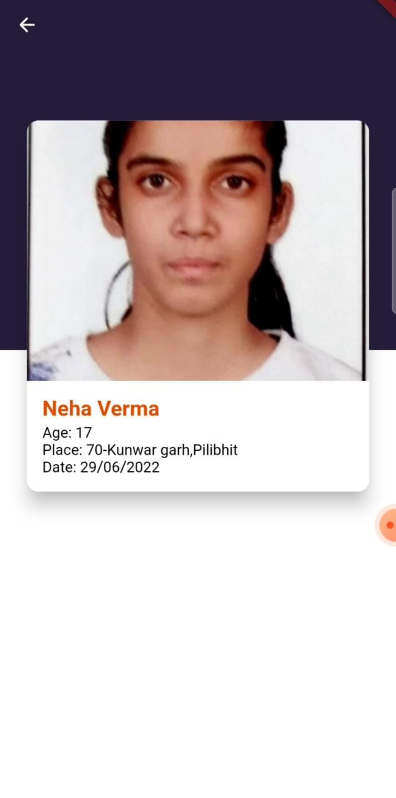

Dashboard Screen            |                  |   My Profile Screen
:-------------------------:|:-------------------------:|:-------------------------:
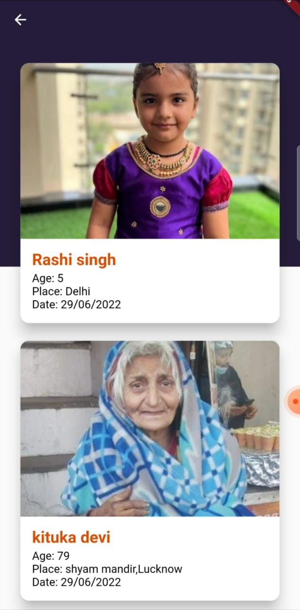  |   |  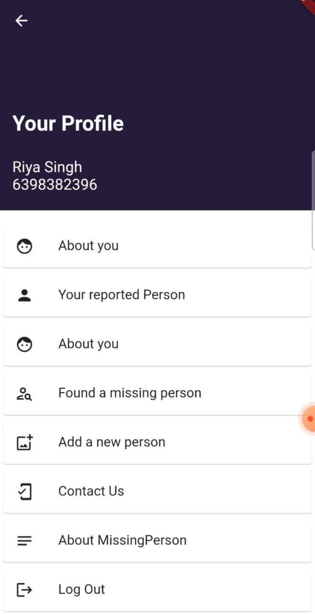

## Future Scope

- A chat system could be established for smooth and direct communication between founder and searcher.
- App can be expanded world wide by adding location filter.
- The ML model could be implemented to make sure picked image is of human only.
- Implement either an on-device API or ML model to send the current GPS location to the searcher without having to supply any additional contextual metadata.
- Act as a powerful tool for Crime investigation department(like Police department) to speed up in their investigation and track the status of multiple cases at a time.